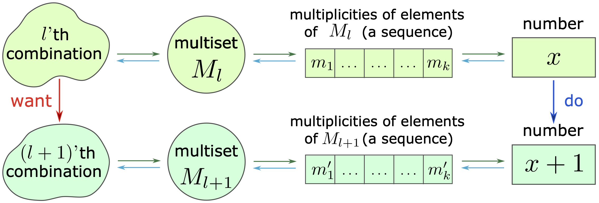
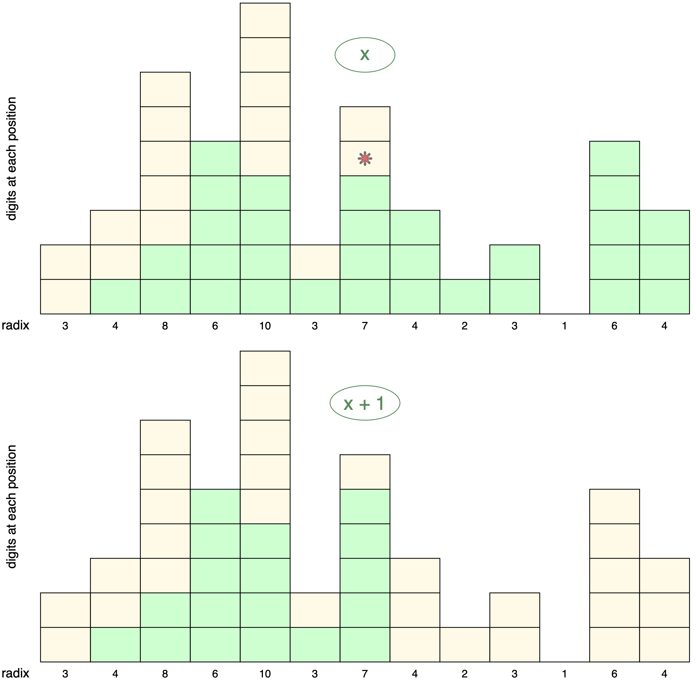
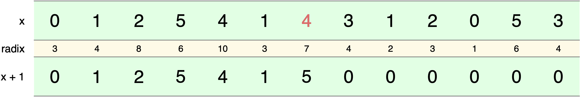

# Combinatorics with MIRSA 
## Generating multisets with mixed radix incrementing algorithm

 

Many problems that require traversing all combinations of a given type that satisfy a number of conditions and performing computations/manipulations on each combination can be conveniently framed in terms of \textbf{multisets}. A multiset $M$, which is a collection of elements that do not need to be distinct (unlike elements in a set), may be defined as a $2$-tuple $(A, m)$, where $A$ is some set of elements that includes those present in $M$ and $m:A \to \mathbb{Z}^{\geqslant}$ is a function from $A$ to the set of non-negative integers giving multiplicity of each element in $A$. Thus $A$ is a superset of the support of $M$, where $Supp(M)$ is a set of unique elements of $M$; $A \supseteq Supp(M)$. 

If a combination is represented by a multiset, all combinations that need to be enumerated can form a collection of multisets. Let $A$ be a finite set containing all the possible elements of the multisets in this collection; in addition, assign some arbitrary order to the elements of $A$. Then each multiset can be represented by a sequence of multiplicities of the ordered elements of $A$, i.e. the number of occurences of each element in a corresponding multiset. For a collection of multisets, these sequences are of the same length and their elements are finite non-negative integers. In turn, each sequence can be thought of as a representation of a \textbf{number} in some positional numeral system, with each element of the sequence being a single digit of that number (regardless of how many digits are used for that element in, for example, the decimal numeral system). Then all the sequences in the collection can be translated into distinct numbers in the same numeral system.

To account for all the combinations, it might be useful to impose some kind of ordering on them and, consequently, a rule prescribing how to move from one combination to the next. Ultimately, finding a rule that would allow one to efficiently traverse all the necessary combinations is the problem to solve. Since a combination can be represented by a single number, moving from that combination to the next can be as simple as incrementing or decrementing that number or, if there are constraints (e.g. a bound on a sum of the digits of the number), moving to the closest "allowed" number. Because different representations of a combination described above are bijective, the "next" number uniquely defines a combination in the collection. A diagram below shows how the chain of these representations can be used to move from a given combination to the next one.

### Positional numeral systems

A base, or __radix__, is the number of unique digits at each position: the smallest digit is $0$ and the greatest is radix minus $1$. 

- Standard systems: fixed base -- same base at each position (e.g. decimal system: base 10, binary system: base 2);
- Non-standard systems: varying base -- different bases are allowed at each position. Time measurement is a common example of that, with 7 days in a week, 24 hours in a day, 60 minutes in an hour and so on. 

The number represented by a sequence of digits $(a_n, a_{n - 1}, \dotsc, a_1, a_0)$ (usually written as $a_n a_{n - 1} \dotsm a_1 a_0$) in a numeral system with radices $(b_n, b_{n - 1}, \dotsc, b_1, b_0)$, $0 < b_i < \infty \;\; \forall \; i$ is equal to $\displaystyle{a_0 + \sum_{i = 1}^n a_i \, \prod_{j = 1}^i b_j}$. 

### Incrementing

Incrementing a number in a __mixed radix__ system can follow the same principal as in standard systems: going from right to left, find the first position that can be incremented, add $1$, and set all the positions to the right of that position to $0$:

The star in the top panel that graphically represents $x$ indicates the position to be incremented. Note that having positions with base $1$ can be useful in some situations. The digital representations of $x$ and $x + 1$ in the same mixed radix numeral system are shown below (in decimal system, their values are $7,917,695$ and $7,917,696$).  

### Constraints

The incrementing procedure described above is outlined in \cite{knuth2011art} Algorithm M (Mixed-radix generation) for generating all $n$-tuples. By incorporating some constraints into that algorithm and adding modifications, we can efficiently solve a surpising number of problems. A very useful constraint would be an upper limit on cardinality of the multisets we want to generate; we might also want to set a lower non-zero bound on a digit at each position. A modification that includes position-associated weights could accomodate another set of problems. Here we extend this simple and intuitive algorithm to include the cardinality constraint, look at other possible extensions, and illustrate the utility of this approach with the following examples: 

- Generate all the collections of non-unique elements of a given size $n$ from a set $A$ of their unique elements (all the multisets $M_l$ such that $|M_l| = n$ and $Supp(M_l) = A$);
- Find all the sub-collections of a given collection $B$ with a cardinality constraint $n$ (all the multisets $M_l$ such that $M_l \subseteq B$ and $|M_l| \leqslant n$);
- Find all the binary sequences with elements in $\{0, 1\}$ of length $k$ where the number of $1$'s does not exceed $n \leqslant k$; 
- Generate all the collections of elements whose sum is equal to a given number $n$.
- Generate all the combinations of $k$ out of $n$ elements.

 

#### For various versions of the algorithm and example problems, see __mirsa.pdf__. 

